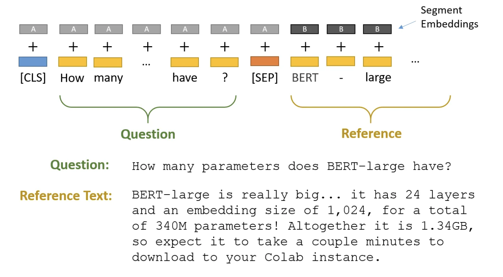
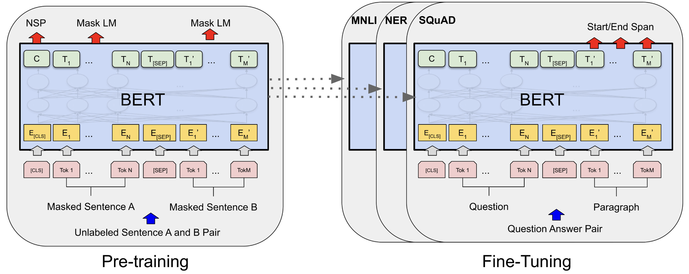
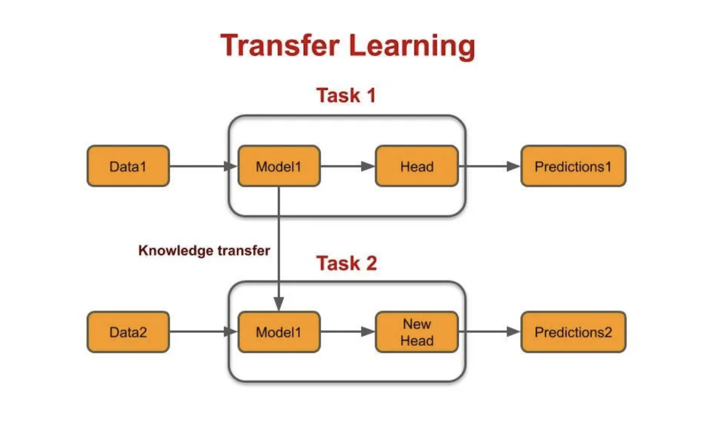

# Question-Answering-Fine-Tuned-BERT
*	Fine-tuned pre-trained BERT model for question answering task using PyTorch and Hugging Face Transformers libraries on SQuAD 1.1 dataset with custom preprocessing functions and hyperparameter tuning, and obtained 88.5 F1 score
*	Overcame question answering data preprocessing challenges: processed long contexts with sliding window technique with stride, handled overflow, generated labels for unanswerable questions, designed tokenizers for training and validation sets
*	Experimented with hyperparameter choices of batch size, stride size, variable learning rate, scheduler rate, implemented custom loss function, and resulted in 12% performance improvement over baseline bert-base-cased + crossEntropyLoss model

## Result
Fine-tuned pre-trained BERT model for question answering task using PyTorch and Hugging Face Transformers libraries on SQuAD 1.1 dataset with custom preprocessing functions and hyperparameter tuning, and obtained 88.5 F1 score

## Data and Resources Used
**Data:** SQuAD 1.1 dataset

**Packages:** Hugging Face transformers, Keras, Numpy, tqdm

## BERT

## Transfer Learning

